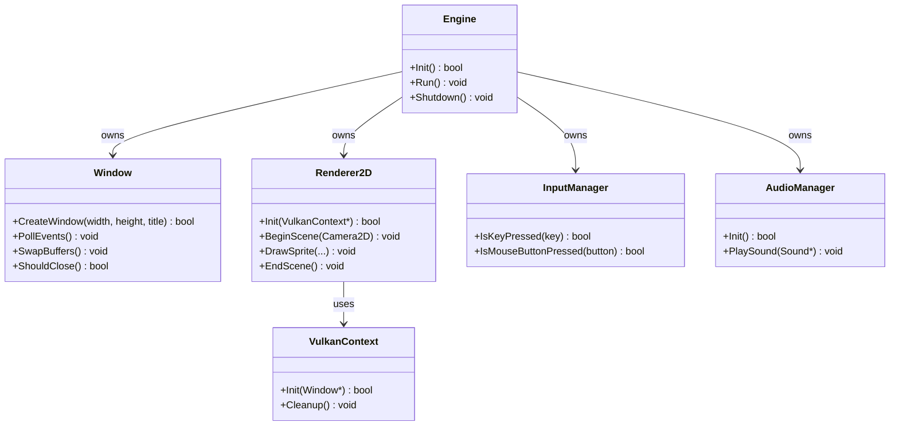

# クラス図 (Vulkan2D)

本機能群の主要なクラスと関連性を示すクラス図です。

```mermaid
classDiagram
    class Engine {
        +Init() bool
        +Run() void
        +Shutdown() void
    }
    class Window {
        +CreateWindow(width, height, title) bool
        +PollEvents() void
        +SwapBuffers() void
        +ShouldClose() bool
    }
    class VulkanContext {
        +Init(Window*) bool
        +Cleanup() void
    }
    class Renderer2D {
        +Init(VulkanContext*) bool
        +BeginScene(Camera2D) void
        +DrawSprite(...) void
        +EndScene() void
    }
    class InputManager {
        +IsKeyPressed(key) bool
        +IsMouseButtonPressed(button) bool
    }
    class AudioManager {
        +Init() bool
        +PlaySound(Sound*) void
    }
    
    Engine --> Window : owns
    Engine --> Renderer2D : owns
    Engine --> InputManager : owns
    Engine --> AudioManager : owns
    Renderer2D --> VulkanContext : uses
```
