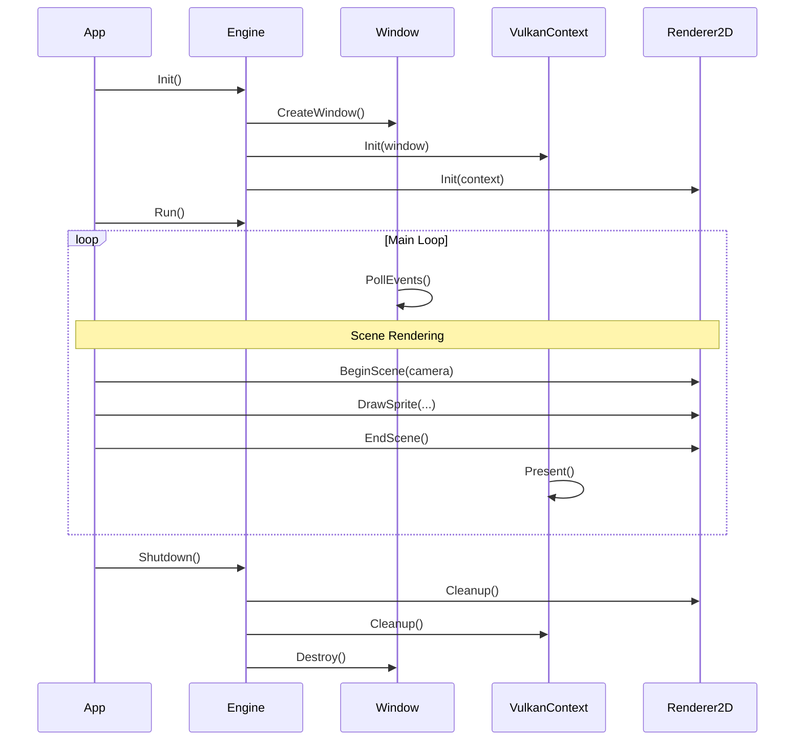

# データフロー図 (Vulkan2D)

## アプリケーションの基本実行フロー

ユーザーアプリケーションを通じてエンジンが初期化・実行される際の一連のデータの流れとプロセス呼び出し順序を示します。

```mermaid
sequenceDiagram
    participant App
    participant Engine
    participant Window
    participant VulkanContext
    participant Renderer2D

    App->>Engine: Init()
    Engine->>Window: CreateWindow()
    Engine->>VulkanContext: Init(window)
    Engine->>Renderer2D: Init(context)
    App->>Engine: Run()
    
    loop Main Loop
        Window->>Window: PollEvents()
        
        Note over App,Renderer2D: Scene Rendering
        App->>Renderer2D: BeginScene(camera)
        App->>Renderer2D: DrawSprite(...)
        App->>Renderer2D: EndScene()
        
        VulkanContext->>VulkanContext: Present()
    end
    
    App->>Engine: Shutdown()
    Engine->>Renderer2D: Cleanup()
    Engine->>VulkanContext: Cleanup()
    Engine->>Window: Destroy()
```
